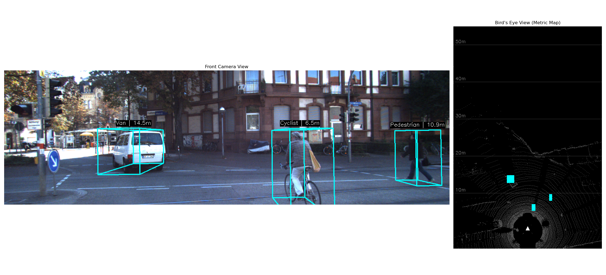

# KITTI LiDAR-Camera Fusion Toolkit 🚗💨

A high-performance Python toolkit for 3D object detection visualization and sensor fusion using the KITTI Vision Benchmark Suite. This project projects 3D LiDAR point clouds and Ground Truth tracklets onto 2D camera imagery and generates real-time Bird's Eye View (BEV) maps.

---

 

## Key Features

* **3D Projection Pipeline:** Full implementation of the KITTI projection chain using Calibration matrices ($P_2$, $R_{0\_rect}$, and $Tr_{velo\_to\_cam}$).
* **Bird's Eye View (BEV):** Real-time generation of top-down metric maps with distance grids (10m intervals) and yaw-aware object footprints.
* **Multi-Sensor Fusion:** Overlaying depth-coded LiDAR point clouds onto RGB camera frames.
* **Automated Video Processor:** Batch processing of image sequences into high-definition `.mp4` perception dashboards.
* **Coordinate Transformations:** Seamless handling of transitions between LiDAR (X-Forward, Y-Left) and Camera (Z-Forward) coordinate systems.


## System Overview

The toolkit provides a comprehensive "Perception Dashboard" consisting of:
1.  **Front-Facing Camera View:** Projected 3D wireframes with object type and metric distance labels.
2.  **Top-Down BEV Map:** A spatial map showing the ego-vehicle (white triangle) and surrounding obstacles in a metric grid.


## Installation

1.  **Clone the repository:**
    ```bash
    git clone https://github.com/punkostigyork/lidar-camera-fusion-toolkit
    cd lidar-camera-fusion-toolkit
    ```

2.  **Create a virtual environment:**
    ```bash
    python -m venv venv
    source venv/bin/activate
    ```

3.  **Install dependencies:**
    ```bash
    pip install -r requirements.txt
    ```


## Project Structure

```text
├── data/
│   └── kitti_sample/              # Place KITTI image_02, velodyne, and calib here
├── src/
│   ├── core/
│   │   ├── projection.py          # Main projection logic & BEV
│   │   ├── transforms.py          # Coordinate system math
│   │   └── sequence_processor.py
│   ├── loaders/
│   │   ├── kitti_loader.py
│   │   └── kitti_labels.py
├── notebooks/
│   └── notebook.ipynb             # Main entry point for visualization
└── outputs/                       # Rendered videos and screenshots

```


## Usage

### 1. Data Setup
The project expects the KITTI tracking sample data (or full dataset) to be organized in a specific hierarchy. Download the **"data_drive_0001"** (or similar) and the **"tracklets"** XML from the [KITTI Website](https://www.cvlibs.net/datasets/kitti/raw_data.php) and arrange them as follows:

```text
data/kitti_sample/
├── calib/
│   ├── 0000.txt, 0001.txt...    # Calibration files
├── image_02/
│   └── data/
│       ├── 0000000000.png...    # Left Color Camera images
├── velodyne_points/
│   └── data/
│       ├── 0000000000.bin...    # LiDAR point clouds (binary format)
└── tracklet_labels.xml          # Ground truth 3D bounding box labels
```
2.  **Verification:** Open `notebooks/notebook.ipynb`. Run the verification cells to check LiDAR alignment and 3D box accuracy on a single frame.
3.  **Production:** Run the final cell to initiate the `SequenceProcessor`, which will render the entire sequence into an MP4 file in the `outputs/` folder.


## The Math Behind the Fusion

The projection of a 3D LiDAR point $\mathbf{X}$ to a 2D pixel coordinate $\mathbf{x}$ is defined by:

$$\mathbf{x} = P_2 \times R_{0\_rect} \times Tr_{velo\_to\_cam} \times \mathbf{X}$$

* **$Tr_{velo\_to\_cam}$**: Rigid transformation from LiDAR to reference camera coordinates.
* **$R_{0\_rect}$**: Rectification to align the coordinate systems.
* **$P_2$**: Intrinsic camera matrix for the color camera.

For the **Bird's Eye View**, we perform a dimensionality reduction by mapping the LiDAR $X$ (forward) and $Y$ (lateral) coordinates directly to a pixel grid, applying a scaling factor (e.g., 10px/meter) to maintain metric consistency.


## 📄 Cite

```bibtex
@misc{lidar-camera-fusion-toolkit,
  author = {Györk Pünkösti},
  title = {KITTI LiDAR-Camera Fusion Toolkit },
  year = {2026},
  publisher = {GitHub},
  url = {https://github.com/punkostigyork/lidar-camera-fusion-toolkit}
}
```


## License
MIT